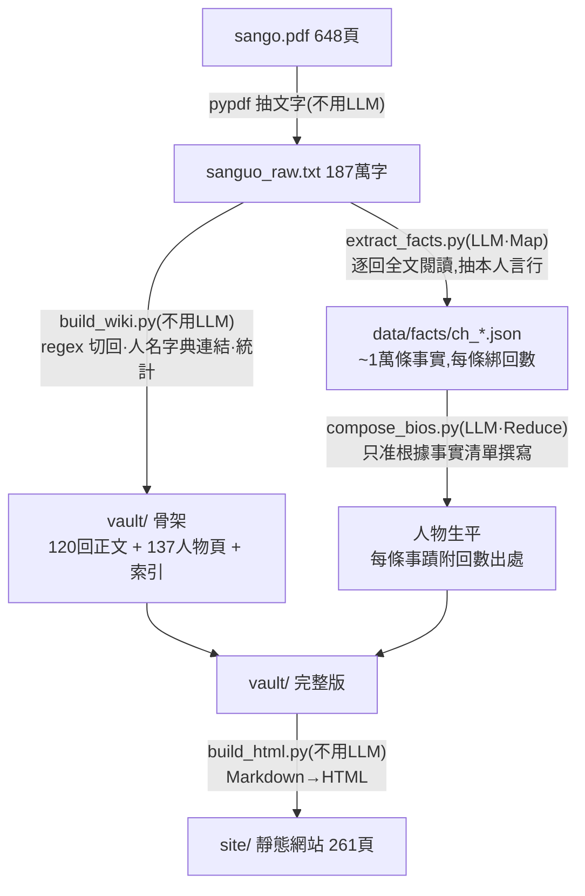

# 三國演義 Wiki

> 「如果我拿一本三國演義原文文字檔 能夠一鍵變成wiki資料庫嗎」

這個專案就是那句話的答案:把一本《三國演義》原文 PDF,自動變成可瀏覽、可查證的 wiki 資料庫。

全書 120 回正文自動切分、人名自動連結,137 位人物各有條目——生平由本地 LLM
以 map-reduce 方式「全文閱讀」原著後生成,**每條事蹟都附回數出處,可回溯查證**。

- **Obsidian vault**(`vault/`):`[[人名]]` 點擊跳轉,graph view 看人物關係網
- **靜態網站**(`site/`,261 頁):零相依,雙擊 `site/index.html` 就能看;
  索引頁即時篩選、自動深色模式,可直接部署 GitHub Pages

## 運作原理

核心想法:**能用純程式做的絕不用 LLM;必須用 LLM 的,不讓它憑記憶說話**。

規則性的工作(切章節、認人名、算統計)交給 regex 和字典,又快又不會錯;
需要「理解」的工作(讀情節、抽事實、寫生平)才交給 LLM,而且強制它只根據
餵給它的原文說話——這是防幻覺的關鍵,詳見下方〈防幻覺設計〉。

### 處理流程



### 哪裡用 LLM,哪裡不用

| 步驟 | 工具 | 為什麼 |
|---|---|---|
| PDF 抽文字 | pypdf,**不用 LLM** | 機械轉換,程式做零錯誤 |
| 切 120 回 | regex「第○○回」,**不用 LLM** | 章回標題格式固定 |
| 人名連結 | 人物字典(`characters.py`)+ 最長優先匹配,**不用 LLM** | 「孔明→諸葛亮」是查表,不需要理解 |
| 出場統計、索引、導航 | 純 Python,**不用 LLM** | 數數而已 |
| 逐回抽事實(Map) | **LLM** | 「這一回趙雲做了什麼」需要讀懂情節 |
| 撰寫人物生平(Reduce) | **LLM** | 把 499 條零散事實組織成通順傳記,需要語言能力 |
| Markdown → HTML | 純 Python,**不用 LLM** | 格式轉換 |

不用 LLM 的步驟全部秒級完成;用 LLM 的兩步在本地 vLLM(Qwen3.6-35B)上跑約
3-4 小時,零 API 費用。

## 快速開始

只是想看:用 Obsidian 開啟 `vault/`,或用瀏覽器開 `site/index.html`,完事。

想自己生成(或換一本書),需要:

- Python 3 + `pypdf`
- 一個 OpenAI 相容的 LLM 端點(本專案用 vLLM 跑 Qwen3.6-35B,
  端點與模型名在 `scripts/extract_facts.py` 開頭兩行,自行修改)

```bash
# 0. 把原文 PDF 抽成純文字 data/sanguo_raw.txt(見下方「換一本書」)
python scripts/build_wiki.py      # 1. 切章回 + 人名連結 + 人物頁/索引(秒級)
python scripts/extract_facts.py   # 2. Map:逐回全文餵 LLM,抽結構化事實(~2-3 小時)
python scripts/compose_bios.py    # 3. Reduce:依事實清單撰寫人物生平(~1 小時)
python scripts/build_html.py      # 4. vault → site 靜態網站(秒級)
```

每一步都可中斷重跑:已完成的章回與人物自動跳過。

## 防幻覺設計

LLM 寫歷史人物最大的問題是幻覺(憑訓練記憶腦補)。第一版直接讓模型
「讀 12,000 字摘錄 + 常識補充」,結果生出「趙雲是結義四弟」這種民間戲曲
才有的說法。改成 map-reduce 後:

1. **Map**:逐回把「完整正文」餵給模型(每回約 5 千~1.5 萬字,遠小於
   context 上限),只准抽取本回正文中該人物「本人言行」的事實,輸出 JSON
   存於 `data/facts/ch_*.json`,每條綁定回數——模型從頭到尾每個字都真的讀過
2. **Reduce**:生平只准根據事實清單撰寫,清單外的內容「即使是常識」也禁止;
   重要事蹟逐條標註回數
3. **輸出防護**:repetition_penalty 抑制小模型的重複迴圈,退化自動偵測 →
   升溫重試 → 程式化去重,三層保底

看到可疑敘述時,打開對應回數的 facts JSON 即可查證來源;錯了就刪那條事實、
重生成該人物(單人約 30 秒),不必重跑全部。

## 專案結構

```
data/sanguo_raw.txt   原文純文字(PDF 抽出)
data/facts/           逐回事實清單(map 產物,生平的可查證來源)
scripts/characters.py 人物表:正名 + 別名(字、號、稱呼)
scripts/*.py          四步流水線
vault/                Obsidian vault(回目/、人物/、索引)
site/                 靜態 HTML 網站(自動生成)
```

## 開發歷程:踩過的坑與學到的事

這個專案是在與 Claude 的一次對話中迭代出來的。過程中遇到的每個問題都很有代表性,
按時間順序記錄如下,供想做類似專案的人參考。

### 第一版:摘錄取樣 + 「常識補充」 → 幻覺

最初的做法:每個人物取樣 12,000 字原文摘錄餵給 LLM,並在 prompt 裡寫了
「摘錄未涵蓋的情節可依小說常識補充」。結果生出**「趙雲是結義四弟」**——
這是民間戲曲的說法,演義原文根本沒有。

> **教訓 1**:幻覺的頭號來源不是模型太小,而是 prompt 允許它腦補。
> 「資料不足時靠常識」這種指令等於邀請模型把訓練記憶混進來,而它的記憶
> 分不清正史、演義、戲曲、電視劇。

### 第二版:map-reduce 全文閱讀

改成逐回把完整正文餵給模型抽事實(Map),再只根據事實清單寫生平(Reduce)。
「趙雲四弟」消失了,還多出「初為袁紹部下」這種第一版漏掉的原文細節。
但馬上撞到新問題:

**小模型的重複迴圈**:低溫度生成長清單時,5 個人物頁的「人物關係」節卡死在
「徐盛、丁奉、凌統、呂蒙、徐盛、丁奉…」循環幾百次直到 token 上限。
用 `repetition_penalty 1.08` + 退化偵測(同名出現 >3 次即判定)+ 升溫重試解決。

> **教訓 2**:重複迴圈是小模型的典型病,大模型很少見;但它可以用參數和
> 後處理防住,不需要換大模型。防護要做成「偵測 → 重試 → 程式化保底」三層,
> 因為前兩層都不保證成功。

**模型的自我修正碎念**:有些頁面出現「大喬(推測基於常識但清單未明確提及,
故不列入)」——嘴上說不列入,還是寫出來了。prompt 加「拿不準的直接省略,
不要解釋為什麼省略」,殘餘一處手動修掉。

> **教訓 3**:LLM 會把「內心掙扎」寫進正式輸出。與其教它怎麼掙扎,
> 不如告訴它掙扎的結果應該長什麼樣(直接省略)。

### 使用者一眼看出的兩個 bug

上線給人看,馬上被抓到兩個問題:

1. **`<!-- source: map-reduce facts -->` 直接顯示在網頁上**——自製的
   Markdown→HTML 轉換器忘了過濾 HTML 註解。
2. **漢獻帝頁寫著「朝政受張讓曹節把持、流放蔡邕」**——那是靈帝朝的事。
   根源:第一回原文通篇只寫「帝」,而漢獻帝只被提了一句「傳至獻帝」,
   抽取時模型把整回皇帝的作為都算到他頭上。

第 2 個問題正好展示這套架構的還手能力:打開 `data/facts/ch_001.json`
立刻定位到 6 條錯誤事實 → 刪除 → 重生成漢獻帝一人(30 秒)→ 修復。
後來把桓帝、靈帝也加入人物表,「泛稱帝」從此有了正主。

> **教訓 4**:每條輸出綁定出處(回數),出錯時才能兩分鐘定位修復,
> 而不是重跑全部。可查證性不是錦上添花,是維運的基礎。

### 擴充人物:自動發現與同名坑

人物表從手工 137 人擴充:統計 LLM 在生平中連結過、但沒有頁面的名字,
按原文出現次數設門檻 N,再用一次 LLM 呼叫過濾掉地名和稱號(候選 758 個裡
只有 183 個是真人)。選 N≥30 新增 31 人。

接著撞上**同名人物坑**:演義裡有兩位馬忠(擒關羽的吳將、蜀漢的平北將軍),
模型把兩人縫成一條故事線,還編出「諸葛亮重新起用馬忠」來圓——吳將馬忠
第 83 回就被刺死了。用特製 prompt 明示「這是兩個人、按時段歸屬事實」重生成解決。

> **教訓 5**:同名人物是自動化 wiki 的固有坑,而且 LLM 彙整時會主動把
> 矛盾「合理化」,比單純漏抓更隱蔽。時間線矛盾(死後復活式)是最好的
> 自動偵測訊號。

### 一句話總結

> 能用純程式做的絕不用 LLM;必須用 LLM 的,餵齊資料、禁止腦補、要求出處,
> 然後在它的輸出後面再放一層程式檢查。

## 換一本書

1. 用 `pypdf` 把 PDF 抽成純文字放 `data/`(或直接放 txt)
2. 改 `build_wiki.py` 的章節切分 regex(本專案認「第○○回」)
3. 換掉 `characters.py` 的人物表
4. 照跑四步

## 授權

《三國演義》原文為公有領域。腳本部分隨意使用。
